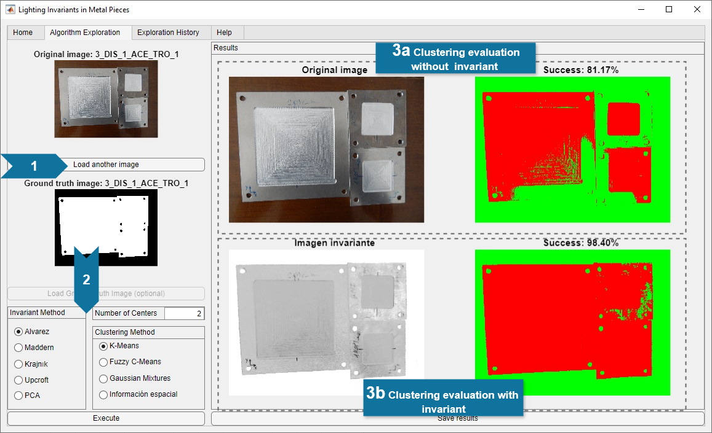

# InvIPM: Optimizing Image Segmentation in Metallic Objects Using Illumination-Invariant Transforms

## Overview

For objects of a metallic nature, illumination generates specular reflections and shadows, which must be minimized to achieve accurate image segmentation. This work proposes to apply illumination invariant transforms before image segmentation to significantly improve processing results. As a case study, a comprehensive set of input images with metallic parts is provided.


## InvIPM Application Description

InvIPM is a MATLAB desktop application that enables users to:

- Load images of metallic objects
- Apply various illumination-invariant transforms
- Perform clustering-based segmentation methods
- Quantify segmentation quality using ground truth comparisons

The application provides an intuitive interface for comparing different processing approaches and evaluating their effectiveness.
 

*Algorithm exploration view of the MATLAB application developed to compare different processing approaches.*

## Repository Structure

This repository is organized into the following main directories:

- **`appcode/`** - Contains the MATLAB InvIPM desktop application code and datasets, including:
  - Input images of metal pieces
  - Corresponding ground truth segmentations
  - Application source code

- **`experiment/`** - Contains experimental results and analysis from testing:
  - 4 illumination invariant algorithms
  - 4 clustering-based segmentation algorithms  
  - 29 metal part images acquired by factory operators
  - Manual segmentations created by researchers
  - Results demonstrating significant improvement in segmentation quality

## Installation

### Prerequisites

You need to have MATLAB Runtime (R2023b) installed on your system.
If it is not installed, you can download it from: [Download MATLAB Runtime R2023b](https://www.mathworks.com/products/compiler/mcr/index.html)

### Installation Steps

1. Download the executable distribution for your operating system from the [releases page](https://github.com/clopezno/InvIPM/releases)
2. Extract the downloaded files to your desired location
3. Run the appropriate executable:
   - **Windows**: Execute `InvIPM.exe`
   - **Linux**: Execute `run.sh`


## Code Quality Assessment

This project includes a comprehensive code quality assessment system to maintain high code standards:

```bash
# Run complete quality assessment
./run_quality_assessment.sh

# Generate HTML quality report
./run_quality_assessment.sh -f html
```

**Current Quality Status**: 6/100 (Improvement needed)
- 📋 [Quality Assessment Guide](README_quality_assessment.md)
- 📊 [Integration Overview](QUALITY_INTEGRATION.md)
- 🔧 [Quality Reports](quality_reports/)


## Contributing

Contributions are welcome! If you wish to contribute to this project, please follow the steps below:

1. Create a fork of the repository.
2. Create a new branch (`git checkout -b feature/new-feature`).
3. Make your changes and commit (`git commit -am ‘Add new feature’`).
4. Push your changes to the branch (`git push origin feature/new-feature`)
5. Open a Pull Request.


## License

This project is licensed under the BSD 3-Clause License . See the [LICENSE](./LICENSE) file for details.


## Authors

- **Jonás Martínez-Sanllorente** - jonasmartinez2000@gmail.com
- **Carlos Lopez-Nozal** - clopezno@ubu.es
- **Pedro Latorre-Carmona** - plcarmona@ubu.es
- **Raúl Marticorena-Sánchez** - rmartico@ubu.es
